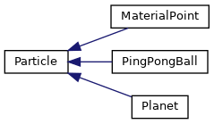
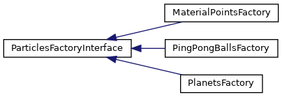
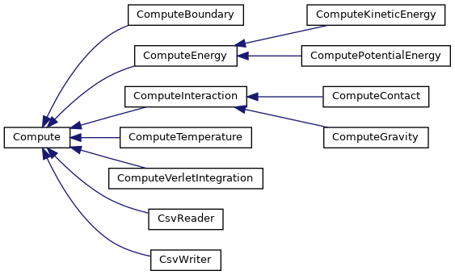

# Week 11 - Homework : Application to a heat equation solver

This code uses the library [FFTW](http://fftw.org/) to code an efficient [heat equation](https://en.wikipedia.org/wiki/Heat_equation) solver.

## Table of Contents

- [Getting Started](#getting-started)
- [Prerequisites](#prerequisites)
- [How it works](#how-it-works)
- [Usage](#usage)
- [Questions](#questions)


## Getting Started

To get a copy of the project on your local machine for development and testing purposes, follow these steps:

1. Clone the repository

```bash
git clone https://github.com/JBil8/sp4e_homeworks_jacopo_thibault.git
cd sp4e_homeworks_jacopo_thibault/Homework3
```

2. Initialize and update the submodules. Here we use Google Test for testing purposes.

```bash
git submodule init
git submodule update
```

3. Compile the program

```bash
mkdir build
cd build
cmake ..
make
mkdir dumps
```
---

# Prerequisites

- A C++ compiler
- CMake for building the project
- [Paraview](https://www.paraview.org/download/) for visualization.

For testing purposes during development we have included a python script `computeFftFreq.py` which requires the following modules:
- **numpy**
- **argparse**
- **matplotlib**

To install these Python dependencies, you can use the following command in the `src` folder:

```bash
pip install -r requirements.txt
```

---

# How it works

In 2D, the transient heat equation is:

$\rho C\frac{\partial\theta}{\partial t} - \kappa(\frac{\partial^2\theta}{\partial x^2} + \frac{\partial^2\theta}{\partial y^2}) = h_v$

with $\rho$ the mass density, $C$ the specific heat capacity, $\kappa$ the heat conductivity, $h_v$ the volumetric heat source and $\theta$ the unknown temperature. By using a Fourier series approach to solve this equation, we transform the differential operators into multiplications:

$\rho C\frac{\partial\hat\theta}{\partial t} + \kappa\hat\theta(q_x^2+q_y^2) = \hat h_v$

with $\hat\theta$ the Fourier transform of $\theta$, and $q_x$ and $q_y$ the coordinates in Fourier space. 

## Structure of the particles code

The code uses a factory design pattern for the different types of particles supported and their respective interface 

and a similar one for the computes 

The Doxyfile can be generated with 
```
doxygen -g
doxygen Doxyfile.doxygen
```
Generated files will be placed in /html directory.

---

# Usage

After creating the executable file, run the program using the following command structure from the `build` directory:

```bash
python ../src/generate_heat_distribution.py --num <n_grid_points> --xlim <inferior_limit_x> <superior_limit_x> --ylim <inferior_limit_y> <superior_limit_y> --filename <filename> --plot  
./particles <n_steps> <dump_freq> input.csv <particle_type> <timestep>
```

### Arguments

- `<n_grid_points>`: Number of points in the 2D grid. Make sure it is a square number
- `<inferior_x_lim>`, `<inferior_y_lim>`, `<superior_x_lim>`, `<superior_y_lim>` : Coordinate values of the extremes of the grid 
- `<filename>`: Filename for storing the initial conditions of the material points on the grid
- `<n_steps>`: Number of iterations.
- `<dump_freq>`: The frequency at which the results are dumped.
- `input.csv`: Contains the informations about the particles. Generated from `generate_input.py`
- `<particle_type>`: For this heat equation solver, we are using particles of type `material_point`.
- `<timestep>`: The time of one iteration.

#### Examples

To launch a simulation for a grid composed of 512*512 particles, with 1000 iterations, dumping every 100 timesteps, and with a timestep of 0.1 :

1. Create the input file and plot the heat distribution

```bash
./src/python3 generate_heat_distribution.py --num 262144 --xlim -1 1 --ylim -1 1 --filename input_mp.csv --plot  
```

2. Launch the simulation from the `build` directory

```bash
./particles 1000 100 input_mp.csv material_point 0.1
```

3. Visualize the results with paraview

- First, launch paraview
```bash
paraview ./dumps
```
- File > Open > "step-..csv" > CSV Reader
- From the properties window :
    - Unselect "Have Headers"
    - Modify "Field Delimiter Characters" from "," to " "
    - Apply the changes
- By pressing Ctrl + Space, type "Table to Points". Press enter.
- In the properties window :
    - Set X, Y and Z to Field 0, 1 and 2
    - Select "2D Points"
    - Apply the changes
- Select 2D on the visualization window
- Back into the porperties window, change the colors to Field 13 to get the temperature and press play.

---
