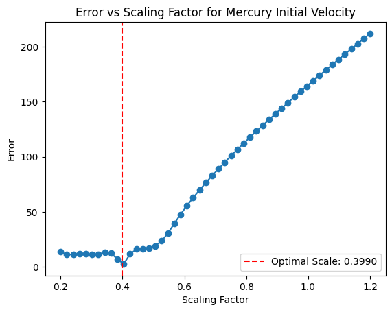

# Week 14 - Homework : Pybind and Trajectory Optimization

The goal of this exercise is to use the external library [Pybind11](https://github.com/pybind/pybind11) to create Python bindings of the C++ Particles’ code.

## Table of Contents

- [Getting Started](#getting-started)
- [Prerequisites](#prerequisites)
- [How it works](#how-it-works)
- [Usage](#usage)
- [Questions](#questions)

## Getting Started

To get a copy of the project on your local machine for development and testing purposes, follow these steps:

1. Clone the repository

```bash
git clone https://github.com/JBil8/sp4e_homeworks_jacopo_thibault.git
cd sp4e_homeworks_jacopo_thibault/Homework4
```

2. Initialize and update the submodules.

```bash
git submodule init
git submodule update
```

3. Compile the program. In the cmake GUI, make sure to change USE_PYTHON to True to allow the binding.

```bash
mkdir build
cd build
cmake ../src
make
mkdir dumps
```


## Prerequisites

- A C++ compiler
- CMake for building the project
- [Paraview](https://www.paraview.org/download/) for visualization.

For testing purposes during development we have included a jupyter notebook `visualization.ipynb` which requires the following modules:
- **numpy**
- **scipy**
- **matplotlib**
- **ipykernel**

To install these Python dependencies, you can use the following command in the `src` folder:

```bash
pip install -r requirements.txt
```

---

# Usage

To launch a simulation, from the `build` folder:
```bash 
python3 main.py <n_steps> <dump_freq> ../src/init.csv <particle_type> <timestep>
```
results will be stored as `.csv` files in the `build/dumps` folder.
### Arguments

- `<n_steps>`: Number of iterations.
- `<dump_freq>`: The frequency at which the results are dumped.
- `../src/init.csv`: Contains the state of planets on January 1st 2000.
- `<particle_type>`: For this planet simulation, we are using particles of type `planet`.
- `<timestep>`: The time of one iteration (in days).

#### Examples

By using the state of planets at the first of January 2000, we launch a 365 days simulation.
Launch from the build folder:
```bash
python3 main.py 365 1 ../src/init.csv planet 1
```

#### Notebook

The notebook `visualization.ipynb` runs some optimization routines to set the optimum parameters for simulations.

It reads data from the reference values provided in the `src/trajectories` folder and compares it to the output of the simulations.
The error can be used to rescale the initial velocity in order to achieve better results for one or more planets.

The optimization routine is performed with the code 
```bash
scaling_factors = np.linspace(min_scale, max_scale, max_number_samples) 
errors = []

for scale in scaling_factors:
    error = runAndComputeError(scale,planet,'init.csv',days,1)
    errors.append(error)

# Find the optimal scaling factor that minimizes the error
optimal_scale = fmin(runAndComputeError, 1.0, args=(planet, 'init.csv', days, 1), disp=False)
```
where `min_scale` and `max_scale` can be selected euristically for the specific case.

In the example provided in the notebook the optimization is performed for `mercury`.




### Questions

**1.2** - The createSimulation function in the ParticlesFactory class is an overloaded template function. It takes a functor func as a parameter, which is then assigned to createComputes. This createSimulation function is designed to allow users to define custom behavior (via func) that is executed at each timestep of the simulation. 

**2.2** - Using **pybind11**, to ensure that references to Compute objects (or any C++ objects) are correctly managed when exposed to Python, it is necessary to specify appropriate return value policies in the bindings. This controls how the lifetime of the object is managed and how references are handled between C++ and Python (e.g. with py::return_value_policy::reference, C++ side is responsible for managing the object’s lifetime). This is done in `.def()`.